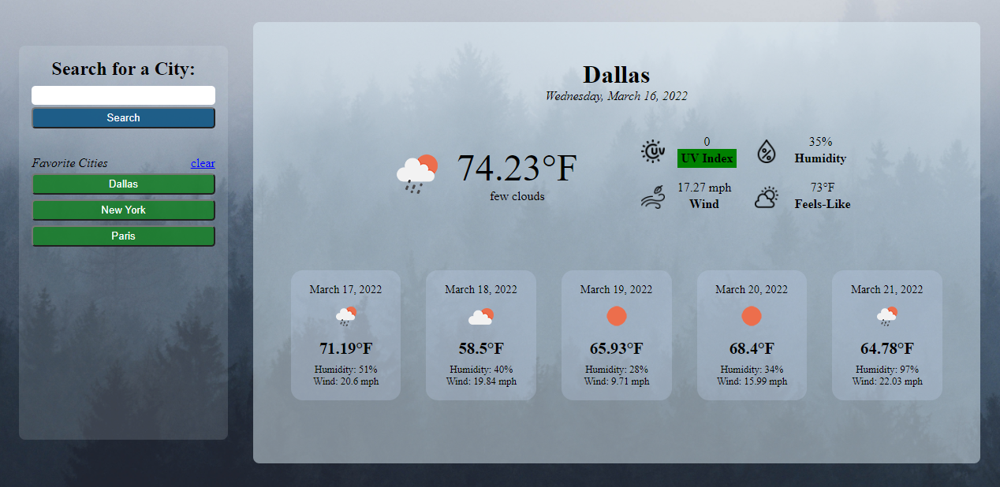
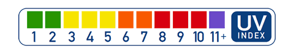

# Weather Dashboard

- A simple weather dashboard
- Allows a user to view the current and future weather conditions (5-day forecast) for any city.
- Built using [OpenWeather Geocoding API](https://openweathermap.org/api/geocoding-api), [OpenWeather One Call API](https://openweathermap.org/api/one-call-api), and plain Javascript.

[Link to weather dashboard](https://nvsco-10.github.io/weather-dashboard/)

 

## Features

 

    

 

<ul>
    <li><b>Favorite Cities</b> - search history is saved and displayed under "Favorite Cities" everytime the user reloads the page. Local storage is used to store search queries.</li> 
    <li><b>UV Index</b> - the UV Index background color changes depending on the uv amount. Color is <a href="https://www.epa.gov/sunsafety/uv-index-scale-0">based on the scale</a> below: </li>
     
    

        
    

<ul>

 

## License

This code is licensed under the MIT License.

 